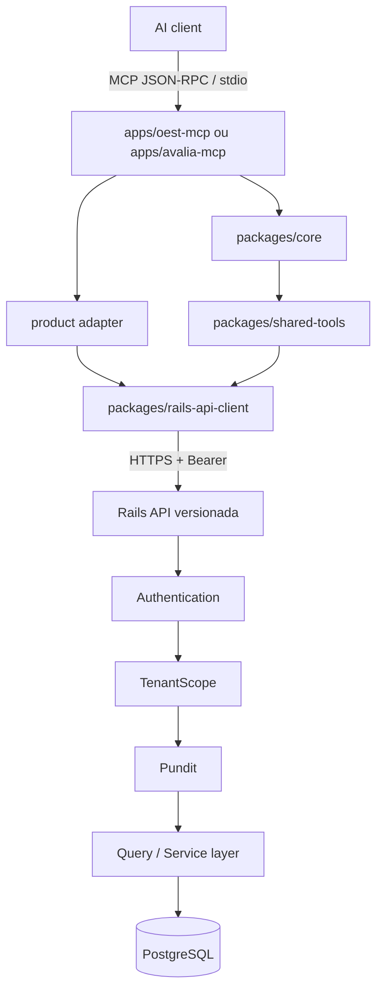
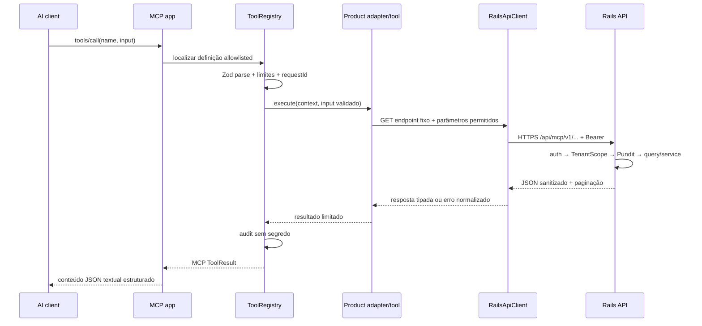
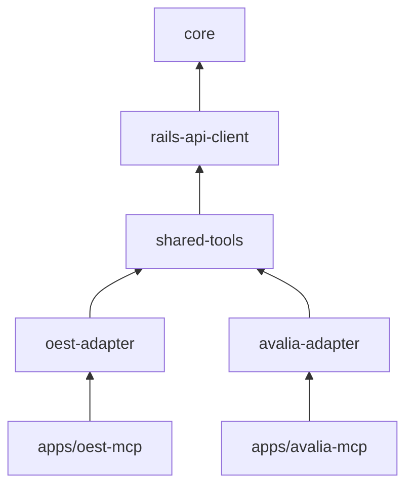

# Arquitetura da MCP Platform

## Decisão

`mcp-platform` é uma plataforma Node.js/TypeScript independente dos Rails apps. Ela executará uma aplicação MCP por produto, reutilizando o mesmo núcleo e chamando somente APIs Rails versionadas e explicitamente allowlisted. V1 será `stdio` e estritamente read-only.



O MCP não se conecta a PostgreSQL, Redis, Sidekiq DB, Rails models, filesystem de uma aplicação, Docker socket, shell ou Rails console. O único caminho para dados de produto é a Rails API.

## Fluxo de uma request



`requestId` nasce no MCP e segue no header `X-Request-Id`. A API pode substituí-lo somente se estiver inválido; ambos os lados registram o mesmo ID para correlação.

## Pacotes e apps

| Unidade | Responsabilidade | Não deve fazer |
|---|---|---|
| `packages/core` | Contratos, registry, orquestração de execução, config validada, erros normalizados, IDs de request, limites e interfaces de log/auditoria/health | conhecer endpoints ou entidades de OEST/Avalia; importar adapters |
| `packages/rails-api-client` | Cliente HTTPS: Bearer, URL allowlisted, timeout, abort, query encoding, teto de resposta, parsing e mapeamento de erros HTTP | registrar tools; conter regra de domínio; aceitar URL do modelo |
| `packages/shared-tools` | Implementações reutilizáveis de saúde, integrações, uso, assinatura, webhooks e uso de API, configuradas por capacidades do adapter | conhecer tabelas Rails ou inventar endpoints de produto |
| `packages/oest-adapter` | Catálogo OEST, schemas Zod, mapeamento de endpoints e respostas de organizações, missões, operadores, quotes/orders/deliverables/jobs | importar app Avalia ou acessar Rails diretamente |
| `packages/avalia-adapter` | Catálogo Avalia, schemas Zod, mapeamento de companies, reviews, leads, pipeline e downloads | importar app OEST ou acessar Rails diretamente |
| `apps/oest-mcp` | Composition root: lê config OEST, instancia client/core/adapter e conecta o transport `stdio` | duplicar tools, políticas ou cliente HTTP |
| `apps/avalia-mcp` | Composition root equivalente para Avalia | duplicar tools, políticas ou cliente HTTP |

## Regras de dependência



Uma seta aponta para a dependência. Logo, a regra é: `core` ← `rails-api-client` ← `shared-tools` ← adapters ← apps. `core` nunca importa camadas acima, adapters não se importam mutuamente e apps não são bibliotecas. Interfaces em `core` invertem dependências de infraestrutura, evitando ciclos.

## Fronteiras e contratos de API

Cada produto deve expor rotas Rails específicas para MCP, preferencialmente em `/api/mcp/v1`. Essas rotas não são um espelho genérico do banco: são read models de agente, com response serializer, autorização Pundit, paginação limitada e dados mínimos necessários. O adapter fixa o caminho e os parâmetros permitidos; uma tool não recebe uma URL, SQL, nome de modelo nem qualquer expressão executável.

Padrão de resposta recomendado:

```ts
type Page<T> = {
  data: T[];
  page: { number: number; size: number; total?: number; nextCursor?: string };
  requestId: string;
};

type ApiProblem = {
  code: "UNAUTHENTICATED" | "FORBIDDEN" | "NOT_FOUND" | "VALIDATION" |
        "RATE_LIMITED" | "UPSTREAM_UNAVAILABLE" | "INTERNAL";
  message: string; // seguro para o chamador; sem segredo ou stack
  requestId: string;
};
```

O MCP preserva `requestId`, mas converte `ApiProblem` em mensagens de tool seguras. O corpo de erro bruto, stack trace e headers nunca são devolvidos ao modelo.

## Contratos TypeScript propostos

São assinaturas de desenho para Phase 1, não implementação desta fase.

```ts
import type { z } from "zod";

export type ReadOnlyMode = "read_only";

export interface McpProductAdapter {
  readonly product: "oest" | "avalia" | (string & {});
  readonly displayName: string;
  readonly toolDefinitions: readonly ToolDefinition[];
  readonly healthProvider?: HealthProvider;
  configure(registry: ToolRegistry): void;
}

export interface ToolDefinition<TInput extends z.ZodType = z.ZodType, TOutput = unknown> {
  readonly name: string;
  readonly title: string;
  readonly description: string;
  readonly inputSchema: TInput;
  readonly readOnly: true;
  readonly domain: "shared" | string;
  readonly execute: (
    context: ToolExecutionContext,
    input: z.infer<TInput>,
  ) => Promise<ToolExecutionResult<TOutput>>;
}

export interface ToolRegistry {
  register(definition: ToolDefinition): void;
  get(name: string): ToolDefinition | undefined;
  list(): readonly ToolDefinition[];
  execute(name: string, rawInput: unknown, context: ToolExecutionContext): Promise<ToolExecutionResult>;
}

export interface ToolExecutionContext {
  readonly requestId: string;
  readonly product: string;
  readonly principal: McpPrincipal;
  readonly config: McpConfig;
  readonly rails: RailsApiClient;
  readonly logger: Logger;
  readonly audit: AuditSink;
  readonly deadline: AbortSignal;
}

export interface RailsApiClient {
  get<TResponse>(request: RailsGetRequest): Promise<RailsApiResponse<TResponse>>;
}

export interface RailsGetRequest {
  readonly route: AllowedRailsRoute;
  readonly pathParams?: Readonly<Record<string, string>>;
  readonly query?: Readonly<Record<string, string | number | boolean | undefined>>;
  readonly signal: AbortSignal;
}

export interface McpConfig {
  readonly product: string;
  readonly transport: "stdio" | "streamable-http";
  readonly railsBaseUrl: URL;
  readonly railsAllowedOrigins: readonly string[];
  readonly apiKey: SecretString;
  readonly requestTimeoutMs: number;
  readonly maxResponseBytes: number;
  readonly maxPageSize: number;
  readonly rateLimit: { readonly windowMs: number; readonly maxCalls: number };
  readonly readOnly: ReadOnlyMode;
}

export interface AuditSink {
  record(event: AuditEvent): Promise<void>;
}

export interface Logger {
  debug(event: LogEvent, message: string): void;
  info(event: LogEvent, message: string): void;
  warn(event: LogEvent, message: string): void;
  error(event: LogEvent, message: string): void;
}

export interface HealthProvider {
  getSystemHealth(context: ToolExecutionContext): Promise<ToolExecutionResult<SystemHealth>>;
  getIntegrationHealth(context: ToolExecutionContext): Promise<ToolExecutionResult<IntegrationHealth>>;
}
```

Tipos auxiliares serão definidos em `core`: `McpPrincipal` contém identidade e escopo efetivo emitidos pela autenticação, nunca um tenant escolhido pelo modelo; `AllowedRailsRoute` é uma união fechada por adapter; `SecretString` não tem serialização/log; e `ToolExecutionResult` diferencia sucesso seguro de erro operacional classificado.

## Extensibilidade

Um terceiro produto fornece um `FooProductAdapter` que implementa `McpProductAdapter`, declara schemas e rotas pertencentes a `foo`, e cria `apps/foo-mcp` como composition root. Não modifica `core`, não altera os adapters existentes e não cria dependência de seus modelos Rails. Se Foo suportar uma capacidade compartilhada, ele fornece o endpoint contratado pelo shared tool ou omite a capability — uma tool não deve aparecer sem backend autorizado.

## Decisões de implementação para a próxima fase

- Usar MCP SDK, Zod e `fetch`/cliente HTTP nativo, sem dependências adicionais até existir necessidade concreta.
- Transport V1: `stdio`; stdout só contém mensagens do protocolo e logs usam stderr/structured sink.
- Métodos permitidos V1: somente `GET` contra rotas literais previamente registradas.
- Resources MCP ficam fora do escopo inicial; podem ser adicionados depois de as tool contracts estarem estáveis.
- A Rails API é a autoridade para autenticação, `TenantScope`, Pundit, shape de dados e regras de negócio.
