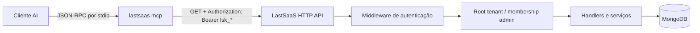

# Análise arquitetural do LastSaaS

Data da análise: 2026-09-17. Referência estudada diretamente no repositório [jonradoff/lastsaas](https://github.com/jonradoff/lastsaas), branch `master`. Esta é uma referência de arquitetura; não é uma base de código a ser copiada.

## Evidências consultadas

- [`backend/cmd/lastsaas/cmd_mcp.go`](https://github.com/jonradoff/lastsaas/blob/master/backend/cmd/lastsaas/cmd_mcp.go): bootstrap, cliente HTTP e registro das tools.
- [`backend/cmd/lastsaas/main.go`](https://github.com/jonradoff/lastsaas/blob/master/backend/cmd/lastsaas/main.go): subcomando `mcp` e carregamento de ambiente.
- [`backend/internal/middleware/auth.go`](https://github.com/jonradoff/lastsaas/blob/master/backend/internal/middleware/auth.go): Bearer, API keys, JWT e resolução do tenant raiz.
- [`backend/internal/api/handlers/`](https://github.com/jonradoff/lastsaas/tree/master/backend/internal/api/handlers): handlers de health, admin, billing, webhooks, telemetria e documentação HTTP.
- [`README.md`](https://github.com/jonradoff/lastsaas/blob/master/README.md), [`server.json`](https://github.com/jonradoff/lastsaas/blob/master/server.json), [`manifest.json`](https://github.com/jonradoff/lastsaas/blob/master/manifest.json) e [`smithery.yaml`](https://github.com/jonradoff/lastsaas/blob/master/smithery.yaml): distribuição, configuração e posicionamento do servidor.

## Arquitetura observada

O comando `lastsaas mcp` obtém `LASTSAAS_URL` e `LASTSAAS_API_KEY`, cria um cliente HTTP de 30 segundos e inicia um `MCPServer` da biblioteca Go. A execução bloqueia em `ServeStdio`; portanto, `stdout` é reservado ao protocolo MCP e erros de bootstrap são emitidos em `stderr`.

O MCP é uma camada de apresentação/proxy. Não consulta MongoDB, modelos ou serviços internos diretamente. Cada handler MCP monta um caminho HTTP conhecido, faz `GET`, encaminha o Bearer token e devolve o corpo JSON identado como conteúdo textual da tool. Em recursos MCP, a mesma técnica expõe `lastsaas://dashboard` e `lastsaas://health` como `application/json`.

## Registro e agrupamento de tools

`cmd_mcp.go` registra funções de domínio separadas, todas em um único processo MCP. Cada tool recebe descrição, esquema de entrada construído pelo SDK e a anotação `readOnlyHint: true`.

| Grupo | Exemplos | Contrato HTTP observado |
|---|---|---|
| Sobre e dashboard | `get_about`, `dashboard_stats` | `/api/admin/about`, `/api/admin/dashboard` |
| Tenants | `list_tenants`, `get_tenant` | listagem paginada e detalhe em `/api/admin/tenants` |
| Usuários | `list_users`, `get_user` | paginação, busca, status e detalhe em `/api/admin/users` |
| Financeiro | `list_transactions`, `get_financial_metrics` | transações e séries de revenue/ARR/DAU/MAU |
| Logs | `search_logs`, `get_log_severity_counts` | filtros de severidade, categoria, texto e período |
| Saúde | `get_system_health`, `get_health_metrics`, `list_nodes`, `get_integrations` | snapshot, séries, nós e dependências externas |
| Configuração e planos | `list_config`, `get_config`, `list_plans`, `get_plan` | leitura de configuração e catálogo comercial |
| Segurança | `list_api_keys`, `list_root_members` | metadados de chaves e membros administrativos |
| Webhooks | `list_webhooks`, `list_webhook_event_types`, `get_webhook` | configurações, tipos e histórico de entrega |
| Produto/telemetria | `get_funnel`, `get_kpis`, `get_retention`, `get_engagement`, `get_custom_events`, `list_event_types` | funil, KPI, coortes, engajamento e eventos |

O código atual soma 33 tools e 2 resources. Há deriva de metadados: `manifest.json` descreve 26 e lista 27 tools, enquanto `VERSIONS.md` menciona 32. Para nossa plataforma, a lista registrada em código e os testes de contrato serão a fonte de verdade; manifestos serão gerados/validados contra ela.

## Comportamentos relevantes

### Inicialização, stdio e configuração

- O subcomando `mcp` é selecionado pelo binário principal após carregar o ambiente.
- `LASTSAAS_URL` é obrigatório e configura a base da API; `LASTSAAS_API_KEY` também é obrigatório e marcado como segredo em `server.json`.
- `smithery.yaml` mapeia configuração de instalação para essas variáveis e inicia `./lastsaas mcp` em `stdio`.
- Não há endpoint MCP HTTP no desenho analisado; a API do produto continua sendo HTTP.

### Autenticação e tenant

- O MCP envia `Authorization: Bearer <apiKey>` para toda chamada.
- A API aceita JWT ou chaves com prefixo `lsk_`; ela armazena/consulta o hash da API key, não a chave bruta.
- Uma chave administrativa resolve automaticamente o tenant raiz e uma membership administrativa. As rotas administrativas são autorizadas pela API, não pelo MCP.
- A documentação HTTP da referência indica `X-Tenant-ID` para rotas tenant-scoped e a distinção entre chaves administrativas e de usuário.

### Inputs, paginação, erros e JSON

- Inputs opcionais são definidos explicitamente por tipo: números para `page`/`limit`, strings para filtros e parâmetros obrigatórios para IDs.
- Paginação é repassada à API por query string (`page`, `limit` ou `perPage`); a API permanece responsável por limites, ordenação e metadados de página.
- O cliente usa timeout de 30 s, considera apenas `2xx` como sucesso e transforma qualquer `non-2xx` em resultado de erro MCP.
- Respostas JSON são identadas e devolvidas como texto. IDs de configuração recebem `PathEscape`, mas nem todos os IDs de rota são escapados na camada MCP.

### Saúde, tenants, usuários, billing, webhooks e métricas

- Saúde é produzida no backend: snapshot atual, métricas temporais, nós e integrações. O MCP apenas a lê.
- Tenants e usuários possuem operações de lista e detalhe; o MCP nunca constrói consultas ao banco.
- Financeiro entrega transações filtráveis e métricas de negócio temporais.
- Webhooks expõem configuração, catálogo de eventos e histórico de tentativas; a API também contém operações de escrita, mas elas não são registradas no MCP read-only.
- Produto/analytics é exposto por endpoints de funil, KPI, retenção, engajamento e eventos customizados.

## Responsabilidades: MCP versus API

| Pertence ao MCP | Permanece na API |
|---|---|
| Descoberta de tools, schemas, descrição e transporte MCP | Autenticação, autorização e escopo de tenant |
| Validar sintaticamente inputs e aplicar limites locais | Pundit/policies, regras de negócio e contratos de domínio |
| Chamar apenas rotas allowlisted e mapear erros para MCP | Consultas, paginação, agregações, jobs e acesso ao PostgreSQL |
| Sanitizar/resumir a resposta e registrar auditoria de tool call | Redação de dados de domínio, trilha de auditoria de negócio e observabilidade |
| Não expor tools mutáveis em V1 | Mutations explícitas com idempotência, aprovação e controle transacional |

## Padrões que adotaremos

1. Processo MCP separado, `stdio` no V1 e API HTTP como única fronteira de dados.
2. Registro por domínio e tools pequenas, descritivas e read-only por padrão.
3. API key em Bearer, timeout, parâmetros explícitos e paginação pertencente à API.
4. Exposição de saúde, uso, billing e webhooks como capacidades de leitura, não acesso à infraestrutura.
5. Configuração declarativa de instalação, com segredo marcado como secreto.

## Padrões que não adotaremos sem reforço

- Não repassaremos corpo de erro HTTP bruto ao modelo: erros serão classificados e redigidos.
- Não aceitaremos `baseUrl` arbitrária sem HTTPS e allowlist; a concatenação simples de URL não é suficiente para nossa política anti-SSRF.
- Não retornaremos payloads sem limite; cliente e API terão teto de bytes, tempo e tamanho de página.
- Não confiaremos no `readOnlyHint` como controle de segurança. O contrato da API, a allowlist de métodos `GET` e a ausência de mutation tools são os controles efetivos.
- Não deixaremos manifestos manuais divergirem do registry. Haverá validação de consistência na fase de implementação.
- Não reproduziremos o acesso administrativo global por padrão. Em OEST e Avalia, o escopo efetivo será derivado da credencial/claim autenticada e revalidado pela Rails API; IDs fornecidos pelo modelo só podem estreitar esse escopo.

## Mapeamento para a MCP Platform

| LastSaaS | MCP Platform Core | OEST / DroneHub | Avalia Solar |
|---|---|---|---|
| `list_tenants` / `get_tenant` | abstração de tenancy e paginação | organizações | companies/accounts |
| `list_users` / `get_user` | identidade resumida e tool list/detail | operadores | usuários comerciais/operacionais quando necessário |
| `get_system_health` | `HealthProvider` e tool compartilhada | saúde de API, jobs e integrações DroneHub | saúde de API e integrações Avalia |
| `get_integrations` | health de integrações allowlisted | storage, mapas, notificações, processamento | CRM, e-mail, analytics, downloads |
| financeiro, planos e transações | resumo comercial/billing compartilhado | subscriptions, quotes, orders | plans e assinaturas |
| `list_webhooks` / `get_webhook` | módulo compartilhado de entrega de webhooks | entregas DroneHub | entregas Avalia |
| funil/KPI/engajamento | contratos de métricas de produto | missão, operador e uso de deliverables | reviews, leads, pipeline e materiais |
| cliente Go HTTP | `RailsApiClient` em TypeScript | endpoints OEST versionados | endpoints Avalia versionados |

## Conclusão

O LastSaaS prova a separação mais importante para esta iniciativa: um MCP pode fornecer uma superfície segura e útil para agentes sem ganhar privilégios de banco ou shell. Nossa versão reutilizará esse limite, mas o implementará em TypeScript/Node/MCP SDK/Zod e Rails API, com contratos compartilhados, adaptadores por produto e políticas explícitas de tenant, allowlist, auditoria e redução de dados.
