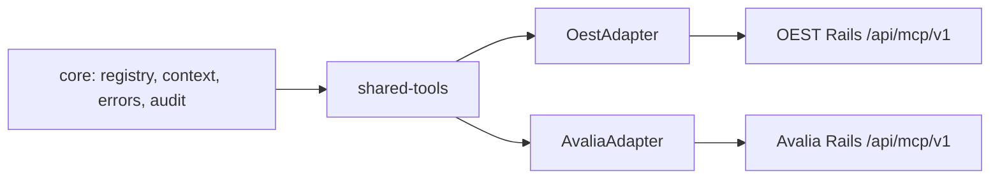

# Adaptadores de produto

## Objetivo

OEST/DroneHub e Avalia Solar usam o mesmo runtime MCP. Um adapter traduz o vocabulário de produto, schemas Zod, rotas Rails fixas e DTOs de resposta para os contratos do `core`. Ele não contém transporte MCP, credenciais, acesso a banco ou regra Rails.



## Convenção de adapter

Cada adapter deve:

1. Implementar `McpProductAdapter` de `core`.
2. Registrar tools com nomes estáveis, descrição humana, `inputSchema` Zod estrito e `readOnly: true`.
3. Mapear a tool para uma rota literal `AllowedRailsRoute`, nunca para URL/SQL/modelo fornecido pelo cliente.
4. Converter a resposta Rails para um DTO mínimo, sem segredo, PII desnecessária ou campos internos.
5. Declarar capabilities compartilhadas apenas quando a Rails API daquele produto fornecer o contrato necessário.
6. Testar compatibilidade adapter ↔ API com fixtures e testes de autorização no Rails app.

Os nomes de rota a seguir são contratos propostos para a próxima fase; não foram criados nesta fase de arquitetura.

## Shared tools V1

| Tool | Contrato lógico | OEST | Avalia Solar |
|---|---|---|---|
| `get_system_health` | `GET /api/mcp/v1/health/system` | Rails, jobs, storage/map/processing quando autorizado | Rails, jobs, CRM/downloads quando autorizado |
| `get_integration_health` | `GET /api/mcp/v1/health/integrations` | integrações DroneHub | CRM, e-mail, analytics e entrega de material |
| `get_usage_summary` | `GET /api/mcp/v1/usage/summary` | missões, processamento e deliverables por scope | leads, reviews e downloads por scope |
| `get_subscription_summary` | `GET /api/mcp/v1/billing/subscription-summary` | plano, assinatura, orders agregados | plano e assinatura agregados |
| `get_failed_webhooks` | `GET /api/mcp/v1/webhooks/failed` | falhas de entregas DroneHub | falhas de entregas Avalia |
| `get_api_key_usage` | `GET /api/mcp/v1/security/api-key-usage` | metadados/uso de chaves, sem chave bruta | metadados/uso de chaves, sem chave bruta |

O `shared-tools` contém a mecânica comum e exige uma capability declarada pelo adapter, por exemplo `health.system`, `billing.summary` ou `webhooks.failed`. Se ela não existir, a tool não é registrada para aquele app — não deve devolver uma simulação ou acesso genérico.

## OEST / DroneHub adapter V1

OEST representa operação de organizações, missões de drone, operadores e artefatos comerciais/operacionais. Seus DTOs deverão reportar estado e agregados, não dados brutos de voo, arquivos de cliente, URLs assinadas nem qualquer segredo de integração.

| Tool | Input permitido | Read model/endpoint Rails proposto | Saída mínima |
|---|---|---|---|
| `get_organization_summary` | `organizationId?` dentro do escopo | `GET /organizations/{id}/summary` ou summary do scope | identidade, estado, contagens e uso agregado |
| `list_missions` | `organizationId?`, `status?`, `from?`, `to?`, `page?` | `GET /missions` | lista paginada: ID, status, datas, organização, totais seguros |
| `get_mission` | `missionId` | `GET /missions/{id}` | detalhe operacional permitido sem telemetria/raw files |
| `get_mission_summary` | `missionId` | `GET /missions/{id}/summary` | estado, duração, progresso, resultados agregados |
| `list_operators` | `organizationId?`, `status?`, `page?` | `GET /operators` | operadores autorizados e capacidade/status resumido |
| `get_operator_summary` | `operatorId` | `GET /operators/{id}/summary` | missões, status e métricas agregadas |
| `get_quote_summary` | `quoteId` | `GET /quotes/{id}/summary` | estado, valor permitido, organização e datas |
| `get_order_summary` | `orderId` | `GET /orders/{id}/summary` | estado, itens agregados, valor autorizado e fulfillment |
| `get_deliverable_summary` | `deliverableId` | `GET /deliverables/{id}/summary` | estado, tipo e processamento; sem URL de download |
| `get_failed_jobs` | `organizationId?`, `kind?`, `page?` | `GET /jobs/failed` | ID, tipo, estado, tentativa, erro sanitizado e timestamps |

`oest-mcp` só compõe `OestAdapter` com config OEST. Não importa Avalia e não conhece endpoints de outro produto.

## Avalia Solar adapter V1

Avalia concentra companies/accounts, avaliações, leads, pipeline comercial e downloads de material. Responses devem respeitar a visibilidade comercial da credencial e reduzir dados de contato ao mínimo necessário.

| Tool | Input permitido | Read model/endpoint Rails proposto | Saída mínima |
|---|---|---|---|
| `get_company_summary` | `companyId` | `GET /companies/{id}/summary` | identificação, estágio, contagens e métricas autorizadas |
| `get_review_summary` | `companyId?`, `period?` | `GET /reviews/summary` | score, volume, distribuição e tendência agregada |
| `get_lead_summary` | `companyId?`, `period?` | `GET /leads/summary` | volume, origem, estágio e conversão; PII minimizada |
| `get_sales_pipeline` | `companyId?`, `period?` | `GET /sales/pipeline` | funil por estágio, valores autorizados e tendências |
| `get_material_download_summary` | `companyId?`, `period?` | `GET /materials/download-summary` | material, volume, período e conversão agregada |

`avalia-mcp` só compõe `AvaliaAdapter` com config Avalia. Nem o MCP nem o adapter determinam se o usuário pode ver um company/lead: Rails resolve isso com `TenantScope` e Pundit.

## Exemplo de extensibilidade: FooProductAdapter

Para integrar Foo sem modificar `core`:

```text
packages/foo-adapter/
  FooProductAdapter implements McpProductAdapter
  foo-tools.ts              # schemas e mapeamentos allowlisted
  foo-dtos.ts               # transformação segura de respostas

apps/foo-mcp/
  main.ts                   # composição: config + RailsApiClient + FooProductAdapter + stdio
```

Foo registra, por exemplo, `get_workspace_summary` e `list_runs`, usa somente `GET /api/mcp/v1/foo/...` e declara `usage.summary` se a API tiver esse read model. O core permanece inalterado porque depende apenas de contratos, e os outros adapters permanecem intocados porque não compartilham entidades.

## Compatibilidade e evolução

- Cada product API versiona o contrato MCP (`/api/mcp/v1`); mudanças breaking introduzem `/v2` ou nova tool.
- Adapters suportam somente um intervalo explícito de versões da API e falham de modo claro quando incompatíveis.
- Tools nunca são renomeadas silenciosamente. Deprecação preserva a antiga por uma janela documentada ou exige major version do app MCP.
- A adição de um campo de resposta é segura apenas após passar pela transformação DTO; remover ou mudar semântica exige teste de contrato e versionamento.
