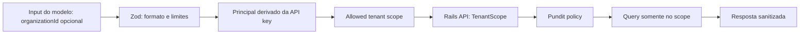

# Segurança da MCP Platform

## Princípios não negociáveis

1. **Read-only por padrão.** V1 registra somente tools declaradas com `readOnly: true` e só permite `GET` contra rotas fixas.
2. **API-first.** MCP não acessa banco, cache, filas, models, console, filesystem da aplicação, Docker ou shell.
3. **A API é a autoridade.** Autenticação, TenantScope, Pundit e validação de regra de negócio são aplicados novamente pela Rails API; o MCP nunca é uma substituição de autorização.
4. **Menor privilégio e menor dado.** Cada app usa credencial de serviço dedicada ao produto/ambiente, com escopos de leitura explicitamente necessários.
5. **Falha fechada.** Tool, rota, parâmetro, origem, método, schema ou scope desconhecido é recusado.

## Modelo de autenticação

O app MCP lê apenas as variáveis de ambiente necessárias no processo: URL Rails allowlisted, API key de serviço e configuração operacional. Ele envia a key exclusivamente como `Authorization: Bearer <token>` por HTTPS. A API identifica o principal e calcula o conjunto de tenants autorizado antes de executar Pundit e a query/service layer.

Expectativas para a Rails API:

- API key é armazenada somente em forma derivada/verificável (hash), tem `key_id`, escopos, produto, ambiente, emissor, expiração, revogação e rotação.
- A key de MCP não equivale a uma chave de administrador humano global. Deve ter escopos como `mcp:oest:read` ou `mcp:avalia:read` e, quando aplicável, tenants/organizações permitidos.
- A API determina o tenant efetivo a partir da key/claim. Um `organizationId` ou `companyId` passado à tool é filtro de estreitamento e é sempre conferido contra o scope; nunca seleciona ou amplia tenant.
- Ambientes de produção, staging e desenvolvimento usam credenciais e allowlists independentes.

## Segredos e logs

- Nunca incluir API keys, Bearer headers, cookies, variáveis de ambiente, URL assinada, token de webhook, PII sensível ou corpo HTTP bruto em logs, auditoria ou resposta MCP.
- `Logger` recebe campos estruturados já redigidos; um redator remove chaves como `authorization`, `token`, `secret`, `apiKey`, `cookie`, `password` e equivalentes case-insensitive.
- A auditoria armazena hashes/IDs de principal e do input normalizado, não o segredo e não payload completo. Aplicar retenção e acesso restrito.
- Erros são classificados por código e `requestId`; stack traces e mensagens internas ficam apenas na observabilidade protegida.
- Rotacionar chaves de serviço sem downtime, manter uma janela curta de sobreposição e revogar imediatamente em incidente.

## Tenant boundary

Não há endpoint de listagem global implícito. Uma tool sem filtro de tenant só é possível para uma key explicitamente autorizada a esse summary agregado; a API deve omitir identificadores/dados de tenants que não possam ser expostos.

## Threat model

| Ameaça | Risco | Controles obrigatórios |
|---|---|---|
| Cross-tenant access | exfiltração entre organizações/companies | scope na key, TenantScope server-side, Pundit, policy test por rota e IDs do modelo apenas restringem scope |
| API key leakage | acesso persistente à API | env/secret manager, key hash na API, redaction, rotação, TTL, revogação, credenciais por ambiente |
| Prompt injection | instruções do conteúdo tentam desviar a tool | registry fechado, schemas Zod, métodos/rotas fixos, nunca executar instruções recebidas nos dados |
| Tool abuse | enumeração, scraping ou uso excessivo | allowlist de tools, rate limit por principal/tool, paginação máxima, quotas, audit e detecção de anomalia |
| SSRF | MCP chama rede interna/metadata | `railsBaseUrl` configurada, HTTPS, hostname/origin allowlist, sem URL do input, sem redirect cross-origin, DNS/IP validation se URL configurável |
| Arbitrary URL execution | leitura ou chamada de URL controlada pelo modelo | não existe tool `fetch_url`; adapters usam `AllowedRailsRoute` literal e query codificada |
| Secrets in logs | vazamento operacional | redaction central, logs estruturados, proibição de body/header bruto, testes de redaction |
| Oversized payload | custo, vazamento e indisponibilidade | `maxResponseBytes`, timeout, page-size máximo, response DTO reduzido, truncamento seguro com aviso |
| DoS | esgotamento de MCP/Rails | timeout/AbortSignal, concorrência limitada, rate limit, circuit breaker, limites de input/saída e backpressure |
| Schema poisoning | schema ou descrição maliciosa vira superfície de controle | schemas Zod versionados em código, builds reprodutíveis, registry não é construído de dados externos, revisão de schema |
| Model-controlled tenant IDs | modelo aponta para tenant não autorizado | ID é validado e conferido na API contra principal; jamais vira header de tenant confiável |
| Future mutation abuse | escrita acidental ou por prompt | V1 sem POST/PUT/PATCH/DELETE; mutation exige ADR, escopo próprio, idempotency key, confirmação humana e audit reforçado |

## Validação e abuso de tools

Cada `ToolDefinition` tem schema Zod estrito (`.strict()` para objetos), nomes de enum fechados, strings com tamanho máximo, números com mínimo/máximo e uma página com teto global. Campos desconhecidos falham; filtros livres são limitados em caracteres e não podem representar SQL, paths, URLs, métodos HTTP ou cabeçalhos.

O `ToolRegistry` rejeita tool inexistente e mede duração, tamanho de input e tamanho de output. Em caso de limite, ele cancela a request sem tentar novamente de forma ilimitada. Retentativas de `GET` são poucas, exponenciais, apenas para erros transitórios e sempre respeitam o deadline original.

## URL e rede

- `RAILS_API_BASE_URL` é uma URL absoluta HTTPS; `http://` é admitido apenas em desenvolvimento explicitamente marcado.
- Host e porta precisam corresponder a allowlist por app/ambiente. Não são aceitos IP privado, loopback ou metadata endpoint em produção.
- O cliente não segue redirect que mude a origem e não expõe redirecionamentos à tool.
- O modelo não controla base URL, path, headers, proxy ou certificado.
- Timeouts cobrem conexão, resposta e corpo; o tamanho do corpo é interrompido antes do parse JSON.

## Sanitização de resposta

Adapters transformam a resposta Rails em DTO próprio da tool. Campos não necessários são descartados, incluindo segredo de webhook, key completa, token, endereço completo quando irrelevante, stack, SQL, configuração sensível e anexos. Textos vindos de usuários são dados inertes: não são interpretados como instruções e podem ser marcados/encapsulados como conteúdo não confiável no cliente AI.

## Auditoria, request IDs e rate limiting

Para cada tool call, `AuditSink` registra: timestamp, `requestId`, produto, tool, principal pseudonimizado, escopo resolvido (IDs não sensíveis), hash do input normalizado, resultado/código, latência, bytes e status de rate-limit. Não registra segredo ou resposta completa.

Aplicar rate limit no MCP e na Rails API. A API é a camada definitiva porque continua protegida mesmo se houver outro cliente; o MCP adiciona defesa para evitar uso desnecessário de recursos. Os limites exatos são configuração operacional, não prompts do modelo.

## Política futura de mutations

Mutations não pertencem ao V1. Para entrar no futuro, cada ação exigirá: ADR aprovada; tool individual e não genérica; schema estrito; autorização Rails específica; preview/dry-run; confirmação humana vinculada ao payload hash; idempotency key; limites de valor/impacto; auditoria imutável; rollback ou compensação quando possível; e monitoramento pós-execução. Permanecem proibidas, inclusive depois disso, tools genéricas como `execute_sql`, `run_sql`, `run_ruby`, `eval`, `shell`, `exec`, `execute_command`, `write_file`, `filesystem` e `database_query`.
