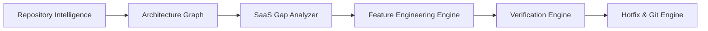

# V5 — Golden SaaS Engineering Platform Architecture

**Date:** 2026-09-17  
**Architects:** Principal Software Architect, Staff Rails Engineer, Staff Next.js Engineer, Security Engineer  
**Status:** Canonical Reference

---

## 1. Executive Summary

The **MCP Platform V5** evolves from a runtime operations server into a **Golden SaaS Engineering Platform**. It establishes a clear, bidirectional separation between **Runtime MCP** (operating production SaaS systems) and **Engineering MCP** (discovering, analyzing, architecting, and evolving SaaS software).

```text
                           MCP PLATFORM
                                |
                +---------------+---------------+
                |                               |
           Runtime MCP                   Engineering MCP
                |                               |
           Product APIs                    Source Code
           Operations                     Architecture Graph
           Runtime Data                   Gap Analysis
           HITL Governance                Feature Engineering
           Rate Limiting & Metrics        Verification & Hotfix
```

---

## 2. Canonical Golden Stack

| Layer | Canonical Technology | Reference Roles |
|---|---|---|
| **Backend** | Ruby on Rails (API mode), ActiveRecord | Business domain, multi-tenancy, transaction lifecycle |
| **Database** | PostgreSQL + PostGIS | Relational data, spatial indexing, strict foreign keys |
| **Jobs & Queues** | Redis + Sidekiq | Asynchronous webhooks, emails, rollup metrics |
| **Auth & Policies** | Devise / JWT + Pundit | Identity verification, scoped role-based access control |
| **Backoffice** | ActiveAdmin | Internal operations, audits, plan management |
| **Frontend** | Next.js (App Router), React, TypeScript | SSR, client state, Tailwind CSS, shadcn/ui |
| **Payments** | Stripe | Subscriptions, customer portal, invoices, credit bundles |
| **Agentic Ops** | Model Context Protocol (MCP) | AI tool registry, HITL approval engine, Stdio/HTTP |

---

## 3. Engineering MCP Subsystems (V5 Pipeline)



1. **Repository Intelligence (`@mcp-platform/repository-intelligence`):** Safe, read-only static analysis discovering stacks, models, controllers, policies, routes, and security findings.
2. **Architecture Graph (`@mcp-platform/architecture-graph`):** Dependency and relationship graph of all system components with evidence and confidence ratings.
3. **SaaS Gap Analyzer (`@mcp-platform/saas-gap-analyzer`):** Evaluates codebase compliance against the formal Golden SaaS Blueprint, producing actionable P0–P3 gap matrices.
4. **Feature Engineering Engine (`@mcp-platform/feature-engineering`):** Generates vertical slice plans across Database, Models, Policies, Services, APIs, Admin, Frontend, and Tests.
5. **Verification Engine (`@mcp-platform/verification-engine`):** Stack-specific release gate validation (Zeitwerk, migrations, RSpec, Typecheck, Build, Security audits).
6. **Hotfix Engine (`@mcp-platform/hotfix-engine`):** Incident reproduction, failing regression test first, patch application, and human-in-the-loop review before Git PR creation.
